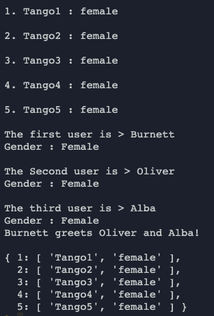

# Java Script Objects Exercise

### Instructions :
  - Create a object '_createUser_' that has name and gender as params 
  - Create its getter & setter methods
  - Create a set of x5 users using a loop and store their information in a dictionary called '_listOfUsers_' and traverse the dict in the format given in the 'Expected Output' section
  - Create x3 users one by one named _Bernard_, _Olivia_ and _Alba_, print their individual information to the console with the text : "Bernard greets Olivia and Alba!"

### Test :
  ```javascript:
  console.log(user1.getName()+" greets "+user2.getName()+" and "+user3.getName()+"!");
  console.log("");
  console.log(listOfUsers);
  ```

### Expected Output :
  
